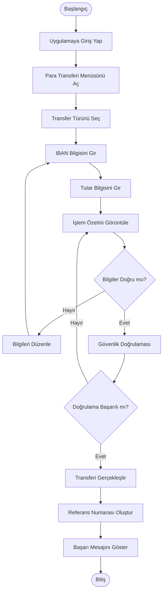

# Activity Diagram - IBAN ile Para Transferi

## Amaç

Bu diyagram, kullanıcının IBAN ile para transferi gerçekleştirme sürecini adım adım göstermektedir.

---

---

## Süreç Açıklaması

1. Kullanıcı uygulamaya giriş yapar.
2. Para transferi ekranını açar.
3. Transfer türünü seçer.
4. Alıcıya ait IBAN bilgisini girer.
5. Transfer tutarını girer.
6. İşlem özetini kontrol eder.
7. Bilgiler doğruysa güvenlik doğrulamasına geçilir.
8. Güvenlik doğrulaması başarılı olursa transfer gerçekleştirilir.
9. Sistem referans numarası oluşturur.
10. Kullanıcıya işlem sonucu gösterilir.

---

## Not

Bu diyagram, yalnızca **IBAN ile para transferi** senaryosunu göstermektedir. Kayıtlı alıcı veya QR Kod ile transfer senaryoları için ayrı Activity Diagram'ları hazırlanabilir.
