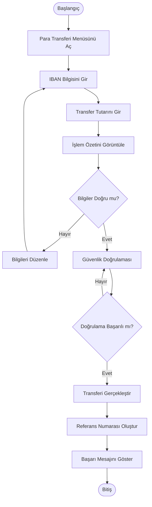

# Activity Diagram - IBAN ile Para Transferi

## Amaç

Bu doküman, mobil bankacılık uygulamasında **IBAN ile para transferi** sürecinin kullanıcı ve sistem açısından adım adım nasıl ilerlediğini göstermek amacıyla hazırlanmıştır.

## Kapsam

Bu diyagram aşağıdaki süreci kapsamaktadır:

- Para transferi ekranının açılması
- IBAN bilgisinin girilmesi
- Transfer tutarının girilmesi
- İşlem özetinin görüntülenmesi
- Güvenlik doğrulaması
- Para transferinin gerçekleştirilmesi
- İşlem sonucunun kullanıcıya gösterilmesi

## Ön Koşullar

- Kullanıcı sisteme giriş yapmış olmalıdır.
- Kullanıcının aktif bir hesabı bulunmalıdır.
- İnternet bağlantısı aktif olmalıdır.

---

## Activity Diagram

---

## Süreç Açıklaması

1. Kullanıcı para transferi ekranını açar.
2. Alıcıya ait IBAN bilgisini girer.
3. Transfer tutarını belirler.
4. İşlem özeti ekranda görüntülenir.
5. Kullanıcı bilgileri kontrol eder.
6. Bilgiler doğruysa güvenlik doğrulamasına geçilir.
7. Güvenlik doğrulaması başarılı olursa transfer gerçekleştirilir.
8. Sistem referans numarası oluşturur.
9. Kullanıcıya başarılı işlem mesajı gösterilir.

---

## Alternatif Akışlar

### AF-01 – Bilgilerin Düzenlenmesi

Kullanıcı işlem özeti ekranında bilgilerin hatalı olduğunu fark ederse IBAN veya tutar bilgisini güncelleyebilir.

### AF-02 – Güvenlik Doğrulaması Başarısız

Doğrulama başarısız olursa kullanıcıdan tekrar doğrulama yapması istenir.

---

## Son Koşullar

Başarılı senaryoda:

- Para transferi gerçekleştirilmiştir.
- Referans numarası oluşturulmuştur.
- İşlem geçmişine kayıt eklenmiştir.

Başarısız senaryoda:

- İşlem tamamlanmaz.
- Kullanıcı uygun hata mesajı ile bilgilendirilir.

---

## Sonuç

Bu Activity Diagram, IBAN ile para transferi sürecinin adım adım iş akışını göstermektedir. Doküman, geliştirme, test ve iş analizi süreçlerinde referans olarak kullanılmak üzere hazırlanmıştır.
