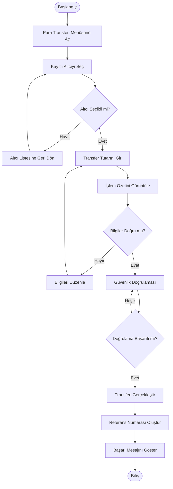

# Activity Diagram - Kayıtlı Alıcı ile Para Transferi

## Amaç

Bu doküman, mobil bankacılık uygulamasında kayıtlı alıcı kullanılarak gerçekleştirilen para transferi sürecinin adım adım iş akışını göstermektedir.

## Kapsam

Bu diyagram aşağıdaki süreci kapsamaktadır:

- Para transferi ekranının açılması
- Kayıtlı alıcı seçimi
- Transfer tutarının girilmesi
- İşlem özetinin görüntülenmesi
- Güvenlik doğrulaması
- Para transferinin tamamlanması

## Ön Koşullar

- Kullanıcı sisteme giriş yapmış olmalıdır.
- Kullanıcının en az bir kayıtlı alıcısı bulunmalıdır.
- Kullanıcının aktif bir hesabı bulunmalıdır.

---

## Activity Diagram

---

## Süreç Açıklaması

1. Kullanıcı para transferi menüsünü açar.
2. Kayıtlı alıcı listesinden alıcı seçer.
3. Transfer tutarını girer.
4. İşlem özeti görüntülenir.
5. Kullanıcı işlem bilgilerini kontrol eder.
6. Bilgiler doğruysa güvenlik doğrulaması yapılır.
7. Doğrulama başarılı olursa transfer gerçekleştirilir.
8. Referans numarası oluşturulur.
9. Başarılı işlem mesajı kullanıcıya gösterilir.

---

## Alternatif Akışlar

### AF-01 – Alıcı Seçilmedi

Kullanıcı kayıtlı alıcı seçmeden işleme devam edemez.

### AF-02 – Bilgilerin Düzenlenmesi

Kullanıcı işlem özetinde transfer tutarını değiştirmek isterse düzenleme ekranına dönebilir.

### AF-03 – Güvenlik Doğrulaması Başarısız

Doğrulama başarısız olursa kullanıcıdan tekrar doğrulama yapması istenir.

---

## Son Koşullar

Başarılı senaryoda:

- Para transferi tamamlanmıştır.
- Referans numarası oluşturulmuştur.
- İşlem geçmişine kayıt eklenmiştir.

Başarısız senaryoda:

- İşlem tamamlanmaz.
- Kullanıcı uygun hata mesajı ile bilgilendirilir.

---

## Sonuç

Bu Activity Diagram, kayıtlı alıcı kullanılarak gerçekleştirilen para transferi sürecinin kullanıcı ve sistem açısından nasıl ilerlediğini göstermektedir. Doküman, geliştirme ve test ekipleri için süreç referansı olarak hazırlanmıştır.
