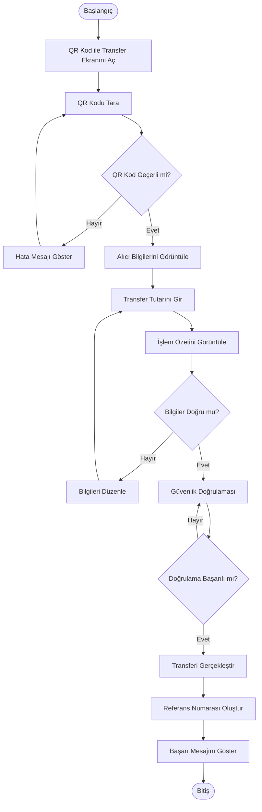

# Activity Diagram - QR Kod ile Para Transferi

## Amaç

Bu doküman, mobil bankacılık uygulamasında QR kod kullanılarak gerçekleştirilen para transferi sürecinin adım adım iş akışını göstermektedir.

## Kapsam

Bu diyagram aşağıdaki süreci kapsamaktadır:

- QR Kod ile Transfer ekranının açılması
- QR kodunun okutulması
- QR kod bilgilerinin doğrulanması
- Alıcı bilgilerinin görüntülenmesi
- Transfer tutarının girilmesi
- İşlem özetinin görüntülenmesi
- Güvenlik doğrulaması
- Para transferinin tamamlanması

## Ön Koşullar

- Kullanıcı mobil bankacılık uygulamasına giriş yapmış olmalıdır.
- Cihaz kamerası kullanılabilir durumda olmalıdır.
- QR kod okunabilir durumda olmalıdır.

---

## Activity Diagram

---

## Süreç Açıklaması

1. Kullanıcı QR Kod ile Transfer ekranını açar.
2. QR kodu cihaz kamerası ile okutur.
3. Sistem QR kodunun geçerliliğini kontrol eder.
4. QR kod geçerliyse alıcı bilgileri otomatik olarak görüntülenir.
5. Kullanıcı transfer tutarını girer.
6. İşlem özeti görüntülenir.
7. Kullanıcı bilgileri kontrol eder.
8. Güvenlik doğrulaması gerçekleştirilir.
9. Doğrulama başarılı olursa transfer işlemi tamamlanır.
10. Referans numarası oluşturulur.
11. Başarılı işlem mesajı kullanıcıya gösterilir.

---

## Alternatif Akışlar

### AF-01 – Geçersiz QR Kod

QR kod okunamıyorsa veya geçersizse kullanıcıya hata mesajı gösterilir ve yeniden okutması istenir.

### AF-02 – Bilgilerin Düzenlenmesi

Kullanıcı işlem özeti ekranında transfer tutarını değiştirebilir.

### AF-03 – Güvenlik Doğrulaması Başarısız

Doğrulama başarısız olursa kullanıcıdan tekrar doğrulama yapması istenir.

---

## Son Koşullar

Başarılı senaryoda:

- Para transferi tamamlanmıştır.
- Referans numarası oluşturulmuştur.
- İşlem geçmişine kayıt eklenmiştir.

Başarısız senaryoda:

- Transfer işlemi gerçekleştirilmez.
- Kullanıcı uygun hata mesajı ile bilgilendirilir.

---

## Sonuç

Bu Activity Diagram, QR kod kullanılarak gerçekleştirilen para transferi sürecinin kullanıcı ve sistem açısından nasıl ilerlediğini göstermektedir. Doküman, geliştirme ve test ekipleri için süreç referansı olarak hazırlanmıştır.
