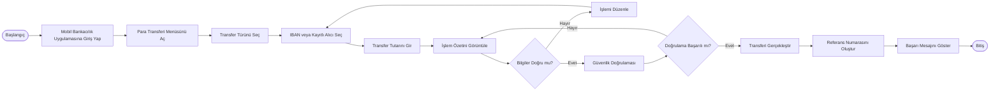

# BPMN - Para Transferi Süreci

## Amaç

Bu diyagram, mobil bankacılık uygulamasındaki para transferi sürecinin uçtan uca iş akışını görselleştirmek amacıyla hazırlanmıştır.

---

## Süreç Akışı

---

## Süreç Açıklaması

1. Kullanıcı mobil bankacılık uygulamasına giriş yapar.
2. Para transferi ekranını açar.
3. Transfer türünü belirler.
4. Alıcı bilgilerini girer veya kayıtlı alıcı seçer.
5. Transfer tutarını girer.
6. İşlem özetini kontrol eder.
7. Güvenlik doğrulamasını tamamlar.
8. Sistem transfer işlemini gerçekleştirir.
9. Referans numarası oluşturulur.
10. İşlem başarıyla tamamlanır.

---

## Notlar

- Bu diyagram hedeflenen (To-Be) süreci temsil etmektedir.
- Süreç, kullanıcı deneyimini iyileştirmek amacıyla tasarlanmıştır.
- İş kuralları ve fonksiyonel gereksinimler dikkate alınarak hazırlanmıştır.
