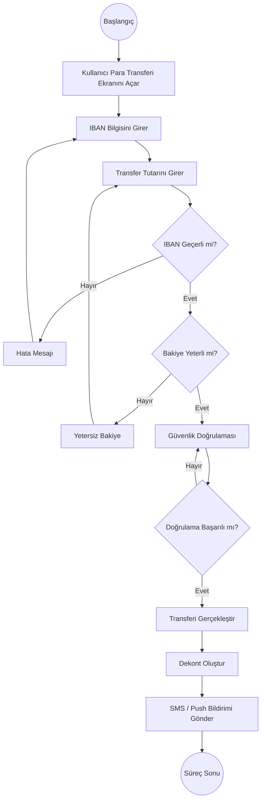

# BPMN - IBAN ile Para Transferi

## Amaç

Bu doküman, dijital bankacılık uygulamasında IBAN ile para transferi sürecinin BPMN (Business Process Model and Notation) mantığına uygun olarak modellenmesini amaçlamaktadır.

## Kapsam

Bu süreç aşağıdaki adımları kapsamaktadır:

- Para transferi talebinin oluşturulması
- IBAN doğrulaması
- Bakiye kontrolü
- Güvenlik doğrulaması
- Transfer işleminin gerçekleştirilmesi
- Dekont oluşturulması
- Kullanıcının bilgilendirilmesi

---

## Süreç Katılımcıları (Pools & Lanes)

| Pool | Lane | Açıklama |
|------|------|----------|
| Müşteri | Banka Müşterisi | Para transferini başlatır. |
| Banka Sistemi | Mobil Uygulama | Kullanıcı işlemlerini yönetir. |
| Banka Sistemi | API | İş kurallarını uygular ve servisleri yönetir. |
| Banka Sistemi | Core Banking | Hesap ve transfer işlemlerini gerçekleştirir. |
| Banka Sistemi | Bildirim Servisi | Kullanıcıya işlem sonucunu bildirir. |

---

## BPMN Süreci

---

## Süreç Açıklaması

1. Kullanıcı para transferi ekranını açar.
2. IBAN ve transfer tutarını girer.
3. Sistem IBAN bilgisini doğrular.
4. Hesap bakiyesi kontrol edilir.
5. Kullanıcının güvenlik doğrulaması tamamlanır.
6. Transfer işlemi gerçekleştirilir.
7. Sistem dekont oluşturur.
8. Kullanıcı SMS veya Push Bildirimi ile bilgilendirilir.
9. Süreç tamamlanır.

---

## Karar Noktaları

### Gateway-01

**IBAN Geçerli mi?**

- Evet → Süreç devam eder.
- Hayır → Kullanıcıdan IBAN bilgisini düzeltmesi istenir.

---

### Gateway-02

**Bakiye Yeterli mi?**

- Evet → Güvenlik doğrulamasına geçilir.
- Hayır → Kullanıcıya yetersiz bakiye bilgisi gösterilir.

---

### Gateway-03

**Güvenlik Doğrulaması Başarılı mı?**

- Evet → Transfer gerçekleştirilir.
- Hayır → Kullanıcı doğrulamayı tekrar yapar.

---

## Başlangıç Olayı (Start Event)

Müşteri para transferi işlemini başlatır.

---

## Bitiş Olayı (End Event)

Transfer başarıyla tamamlanır ve kullanıcı bilgilendirilir.

---

## Sonuç

Bu BPMN modeli, IBAN ile para transferi sürecinin iş akışını BPMN mantığına uygun şekilde göstermektedir. Süreç; iş analistleri, yazılım geliştiriciler ve test ekipleri için ortak bir referans niteliğindedir.
