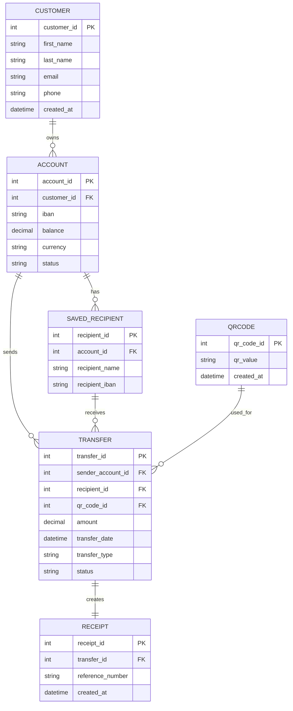

# ER Diagram - Dijital Bankacılık Para Transferi

## Amaç

Bu doküman, dijital bankacılık uygulamasındaki para transferi modülünde kullanılan temel veri varlıklarını (Entity) ve bu varlıklar arasındaki ilişkileri göstermektedir.

## Kapsam

Bu diyagram aşağıdaki veri yapısını kapsamaktadır:

- Müşteri bilgileri
- Banka hesapları
- Para transferleri
- Kayıtlı alıcılar
- QR Kod bilgileri
- İşlem dekontları

---

# Varlıklar (Entities)

| Entity | Açıklama |
|---------|----------|
| Customer | Mobil bankacılık uygulamasını kullanan müşteri |
| Account | Müşteriye ait banka hesapları |
| SavedRecipient | Kullanıcının kayıtlı alıcıları |
| Transfer | Gerçekleştirilen para transferleri |
| Receipt | İşlem sonunda oluşturulan dekont |
| QRCode | QR ile yapılan transferlerde kullanılan bilgiler |

---

# ER Diagram

---

# İlişkiler (Relationships)

| Kaynak | Hedef | İlişki |
|----------|--------|---------|
| Customer | Account | Bir müşteri birden fazla hesaba sahip olabilir. |
| Account | SavedRecipient | Bir hesap birden fazla kayıtlı alıcıya sahip olabilir. |
| Account | Transfer | Bir hesap birçok transfer işlemi başlatabilir. |
| SavedRecipient | Transfer | Bir kayıtlı alıcı birçok transfer alabilir. |
| Transfer | Receipt | Her başarılı transfer için bir dekont oluşturulur. |
| QRCode | Transfer | QR kod kullanılarak transfer gerçekleştirilebilir. |

---

# İş Kuralları

- Her müşteri en az bir banka hesabına sahip olmalıdır.
- Her hesap yalnızca bir müşteriye aittir.
- Bir transfer yalnızca bir gönderen hesap tarafından başlatılabilir.
- Dekont yalnızca başarılı transferler için oluşturulur.
- QR kod yalnızca QR ile transfer senaryosunda kullanılır.
- Transfer türü (IBAN, Kayıtlı Alıcı, QR Kod) sistem tarafından saklanmalıdır.

---

# Sonuç

Bu ER Diagram, dijital bankacılık uygulamasındaki para transferi modülü için temel veri modelini göstermektedir. Veri varlıkları ve aralarındaki ilişkiler, sistem geliştirme, API tasarımı ve veritabanı modelleme çalışmalarına temel oluşturacak şekilde hazırlanmıştır.
