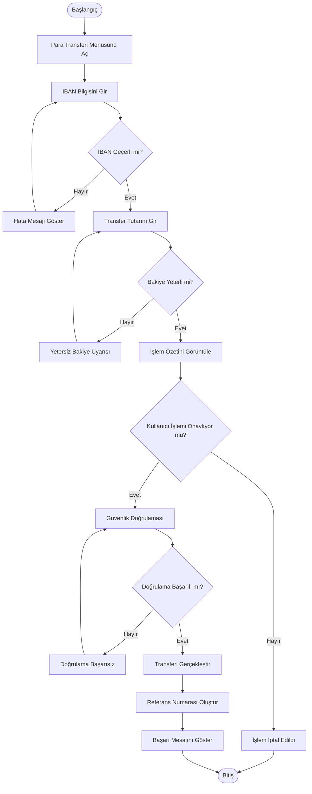

# Flowchart - IBAN ile Para Transferi

## Amaç

Bu doküman, mobil bankacılık uygulamasında **IBAN ile para transferi** sürecinin uçtan uca iş akışını görselleştirmek amacıyla hazırlanmıştır. Süreçte yer alan kullanıcı adımları, sistem karar noktaları ve olası alternatif akışlar bu diyagram ile gösterilmektedir.

## Kapsam

Bu diyagram aşağıdaki adımları kapsamaktadır:

* Mobil bankacılık uygulamasına giriş
* Para transferi ekranına erişim
* IBAN bilgisinin girilmesi
* Transfer tutarının belirlenmesi
* İşlem bilgilerinin kontrol edilmesi
* Güvenlik doğrulaması
* Para transferinin gerçekleştirilmesi
* İşlem sonucunun kullanıcıya gösterilmesi

Bu doküman yalnızca **IBAN ile para transferi** senaryosunu kapsamaktadır. Kayıtlı alıcı ve QR Kod ile transfer senaryoları ayrı dokümanlarda ele alınacaktır.

## Ön Koşullar

* Kullanıcı mobil bankacılık uygulamasına giriş yapmış olmalıdır.
* Kullanıcının aktif ve işlem yapmaya yetkili bir hesabı bulunmalıdır.
* Kullanıcının internet bağlantısı aktif olmalıdır.
* Para transferi hizmeti kullanılabilir durumda olmalıdır.

## Akış Diyagramı

## Süreç Açıklaması

1. Kullanıcı para transferi ekranını açar.
2. Alıcıya ait IBAN bilgisini girer.
3. Sistem IBAN bilgisinin geçerliliğini kontrol eder.
4. Geçerli IBAN girildiğinde kullanıcı transfer tutarını belirler.
5. Sistem hesap bakiyesini kontrol eder.
6. Bakiye yeterliyse işlem özeti gösterilir.
7. Kullanıcı işlem bilgilerini kontrol ederek transferi onaylar.
8. Güvenlik doğrulaması gerçekleştirilir.
9. Doğrulama başarılı olursa para transferi tamamlanır.
10. Sistem referans numarası oluşturur ve kullanıcıya başarılı işlem bilgisini gösterir.

## Alternatif Akışlar

### AF-01 – Geçersiz IBAN

Girilen IBAN geçerli değilse sistem kullanıcıyı uyarır ve IBAN bilgisinin yeniden girilmesini ister.

### AF-02 – Yetersiz Bakiye

Transfer tutarı hesap bakiyesinden yüksekse işlem gerçekleştirilmez ve kullanıcıya yetersiz bakiye bilgisi gösterilir.

### AF-03 – İşlemin İptal Edilmesi

Kullanıcı işlem özeti ekranında transferi onaylamazsa işlem iptal edilir ve süreç sonlandırılır.

### AF-04 – Güvenlik Doğrulaması Başarısız

Güvenlik doğrulaması başarısız olursa sistem kullanıcıdan doğrulamayı tekrar yapmasını ister.

## Son Koşullar

Başarılı senaryoda:

* Para transferi gerçekleştirilmiştir.
* İşlem geçmişine kayıt eklenmiştir.
* Referans numarası oluşturulmuştur.
* Kullanıcıya başarılı işlem mesajı gösterilmiştir.

Başarısız senaryoda:

* İşlem gerçekleştirilmez.
* Kullanıcı uygun hata mesajı ile bilgilendirilir.

## Kullanılan Semboller

| Sembol     | Açıklama                                                                 |
| ---------- | ------------------------------------------------------------------------ |
| Oval       | Başlangıç ve bitiş noktalarını temsil eder.                              |
| Dikdörtgen | Kullanıcı veya sistem tarafından gerçekleştirilen işlemleri temsil eder. |
| Elmas      | Karar noktalarını temsil eder.                                           |
| Ok         | Sürecin ilerleme yönünü gösterir.                                        |

## Sonuç

Bu Flowchart, IBAN ile para transferi sürecinin temel iş akışını ve olası alternatif senaryoları göstermektedir. Diyagram; iş analistleri, yazılım geliştiriciler, test ekipleri ve diğer proje paydaşlarının süreci ortak bir bakış açısıyla değerlendirebilmesi amacıyla hazırlanmıştır.
