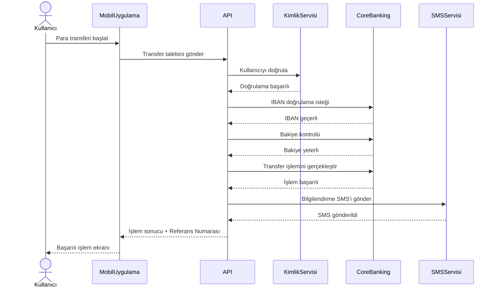

# Sequence Diagram - IBAN ile Para Transferi

## Amaç

Bu doküman, IBAN ile para transferi işlemi sırasında kullanıcı, mobil uygulama ve arka plandaki sistemler arasında gerçekleşen mesajlaşma sırasını göstermektedir.

## Kapsam

Bu diyagram aşağıdaki süreci kapsamaktadır:

- Para transferi talebinin oluşturulması
- Kullanıcı doğrulaması
- IBAN doğrulaması
- Bakiye kontrolü
- Transfer işleminin gerçekleştirilmesi
- İşlem sonucunun kullanıcıya iletilmesi
- SMS bildiriminin gönderilmesi

## Ön Koşullar

- Kullanıcı sisteme giriş yapmış olmalıdır.
- Kullanıcının aktif bir hesabı bulunmalıdır.
- Mobil uygulama ve servisler erişilebilir durumda olmalıdır.

---

## Sequence Diagram

---

## Süreç Açıklaması

1. Kullanıcı mobil uygulama üzerinden para transferini başlatır.
2. Mobil uygulama transfer talebini API katmanına iletir.
3. API, Kimlik Servisi üzerinden kullanıcının kimliğini doğrular.
4. API, Core Banking sisteminden IBAN doğrulaması ister.
5. Core Banking, hesap bakiyesini kontrol eder.
6. Bakiye yeterliyse transfer işlemi gerçekleştirilir.
7. API, SMS Servisi üzerinden kullanıcıya bilgilendirme mesajı gönderir.
8. İşlem sonucu ve referans numarası mobil uygulamaya iletilir.
9. Mobil uygulama başarılı işlem ekranını kullanıcıya gösterir.

---

## Alternatif Akışlar

### AF-01 – Kimlik Doğrulaması Başarısız

Kimlik doğrulaması başarısız olursa işlem sonlandırılır ve kullanıcıya hata mesajı gösterilir.

### AF-02 – Geçersiz IBAN

IBAN doğrulaması başarısız olursa transfer işlemi başlatılmaz ve kullanıcıdan bilgileri düzeltmesi istenir.

### AF-03 – Yetersiz Bakiye

Hesap bakiyesi yetersizse transfer işlemi gerçekleştirilmez.

### AF-04 – SMS Servisine Ulaşılamaması

Transfer işlemi başarılı olsa bile SMS servisine ulaşılamazsa işlem tamamlanır ve hata kaydı oluşturulur.

---

## Son Koşullar

Başarılı senaryoda:

- Para transferi tamamlanmıştır.
- Referans numarası oluşturulmuştur.
- İşlem geçmişine kayıt eklenmiştir.
- Kullanıcı işlem sonucu hakkında bilgilendirilmiştir.

Başarısız senaryoda:

- Transfer işlemi gerçekleştirilmez.
- Kullanıcı uygun hata mesajı ile bilgilendirilir.

---

## Sistemde Yer Alan Bileşenler

| Bileşen | Açıklama |
|----------|----------|
| Kullanıcı | Para transferini başlatan banka müşterisi |
| Mobil Uygulama | Kullanıcının işlem yaptığı istemci uygulama |
| API | İstemci ile bankacılık servisleri arasındaki iletişimi sağlar |
| Kimlik Servisi | Kullanıcının kimliğini doğrular |
| Core Banking | Bankacılık işlemlerini ve hesap kontrollerini gerçekleştirir |
| SMS Servisi | İşlem sonrası kullanıcıya bilgilendirme mesajı gönderir |

---

## Sonuç

Bu Sequence Diagram, IBAN ile para transferi sürecinde sistem bileşenleri arasındaki mesajlaşma sırasını göstermektedir. Doküman; iş analistleri, yazılım geliştiriciler ve test ekiplerinin sistem etkileşimlerini ortak bir bakış açısıyla değerlendirebilmesi amacıyla hazırlanmıştır.
