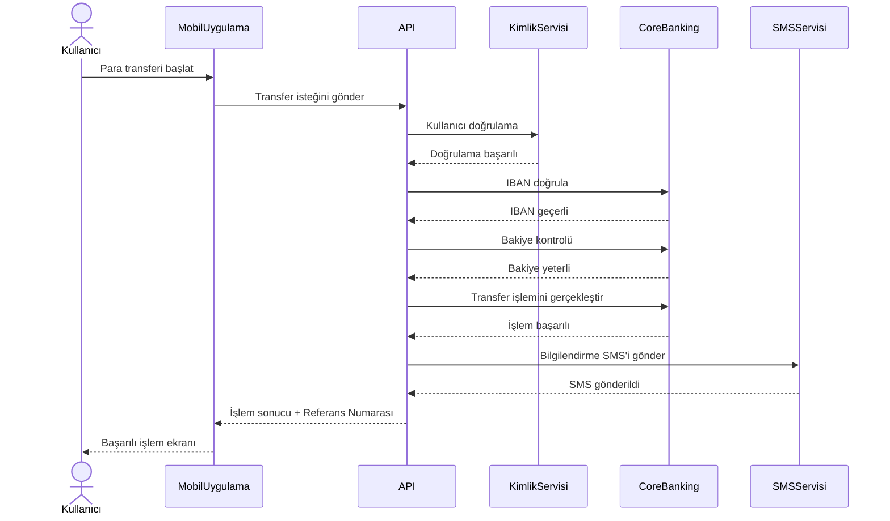

# Sequence Diagram - IBAN ile Para Transferi

## Amaç

Bu diyagram, IBAN ile para transferi işlemi sırasında sistem bileşenleri arasındaki mesajlaşma sırasını göstermektedir.

---

---

## Süreç Açıklaması

1. Kullanıcı mobil uygulama üzerinden para transferini başlatır.
2. Mobil uygulama transfer isteğini API katmanına iletir.
3. API, kullanıcının kimliğini doğrular.
4. API, Core Banking sistemi üzerinden IBAN doğrulaması yapar.
5. Hesap bakiyesi kontrol edilir.
6. Transfer işlemi gerçekleştirilir.
7. Başarılı işlem sonrasında SMS bildirimi gönderilir.
8. API, işlem sonucunu ve referans numarasını mobil uygulamaya iletir.
9. Mobil uygulama kullanıcıya başarılı işlem ekranını gösterir.

---

## Diyagramda Yer Alan Bileşenler

| Bileşen | Açıklama |
|---------|----------|
| Kullanıcı | Para transferini başlatan banka müşterisi |
| Mobil Uygulama | Kullanıcının işlem yaptığı istemci uygulama |
| API | Mobil uygulama ile bankacılık servisleri arasındaki iletişimi sağlar |
| Kimlik Servisi | Kullanıcının kimliğini doğrular |
| Core Banking | Bakiye kontrolü ve para transferi işlemlerini gerçekleştirir |
| SMS Servisi | İşlem sonrası bilgilendirme mesajını gönderir |

---

## Sonuç

Bu diyagram, IBAN ile para transferi sırasında sistem bileşenleri arasındaki iletişim sırasını göstermektedir. Sequence Diagram sayesinde geliştiriciler, test ekipleri ve iş analistleri sistem etkileşimlerini ortak bir bakış açısıyla değerlendirebilir.
