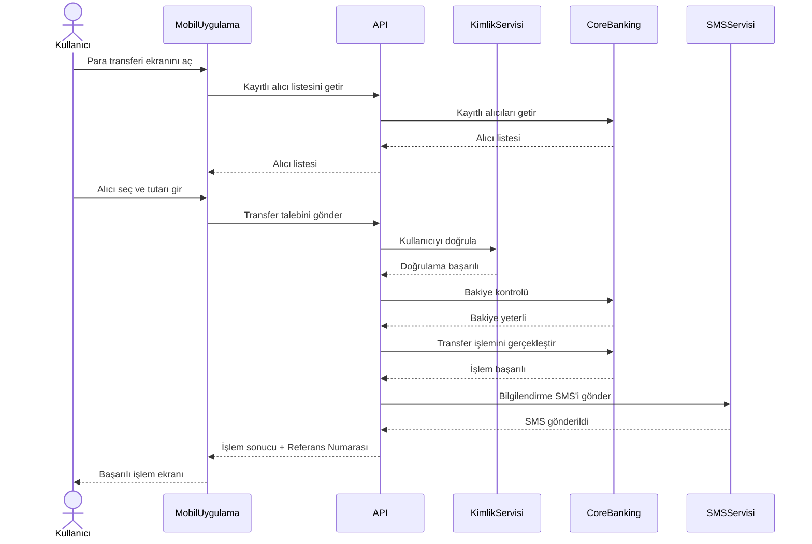

# Sequence Diagram - Kayıtlı Alıcı ile Para Transferi

## Amaç

Bu doküman, kayıtlı alıcı kullanılarak gerçekleştirilen para transferi sırasında kullanıcı, mobil uygulama ve arka plandaki sistemler arasında gerçekleşen mesajlaşma sırasını göstermektedir.

## Kapsam

Bu diyagram aşağıdaki süreci kapsamaktadır:

- Kayıtlı alıcı listesinin görüntülenmesi
- Alıcı bilgilerinin getirilmesi
- Transfer talebinin oluşturulması
- Kullanıcı doğrulaması
- Bakiye kontrolü
- Transfer işleminin gerçekleştirilmesi
- SMS bildiriminin gönderilmesi
- İşlem sonucunun kullanıcıya iletilmesi

## Ön Koşullar

- Kullanıcı sisteme giriş yapmış olmalıdır.
- Kullanıcının en az bir kayıtlı alıcısı bulunmalıdır.
- Mobil uygulama ve servisler erişilebilir durumda olmalıdır.

---

## Sequence Diagram

---

## Süreç Açıklaması

1. Kullanıcı para transferi ekranını açar.
2. Mobil uygulama kayıtlı alıcı listesini API üzerinden talep eder.
3. API, Core Banking sisteminden kayıtlı alıcı bilgilerini alır.
4. Kullanıcı alıcıyı seçer ve transfer tutarını girer.
5. Transfer talebi API'ye iletilir.
6. API, kullanıcı doğrulamasını gerçekleştirir.
7. Core Banking sistemi hesap bakiyesini kontrol eder.
8. Bakiye yeterliyse transfer işlemi gerçekleştirilir.
9. SMS servisi kullanıcıya bilgilendirme mesajı gönderir.
10. İşlem sonucu ve referans numarası mobil uygulamaya iletilir.
11. Kullanıcı başarılı işlem ekranını görüntüler.

---

## Alternatif Akışlar

### AF-01 – Kayıtlı Alıcı Bulunamadı

Kullanıcının kayıtlı alıcısı bulunmuyorsa sistem kullanıcıyı bilgilendirir ve yeni alıcı eklemesi istenir.

### AF-02 – Kimlik Doğrulaması Başarısız

Kimlik doğrulaması başarısız olursa işlem sonlandırılır.

### AF-03 – Yetersiz Bakiye

Hesap bakiyesi yetersizse transfer işlemi gerçekleştirilmez.

### AF-04 – SMS Servisine Ulaşılamadı

Transfer başarılı olsa bile SMS servisine ulaşılamazsa hata kaydı oluşturulur ve işlem tamamlanır.

---

## Son Koşullar

Başarılı senaryoda:

- Para transferi tamamlanmıştır.
- Referans numarası oluşturulmuştur.
- İşlem geçmişine kayıt eklenmiştir.
- Kullanıcı işlem sonucu hakkında bilgilendirilmiştir.

Başarısız senaryoda:

- Transfer işlemi gerçekleştirilmez.
- Kullanıcı uygun hata mesajı ile bilgilendirilir.

---

## Sistemde Yer Alan Bileşenler

| Bileşen | Açıklama |
|----------|----------|
| Kullanıcı | Para transferini başlatan banka müşterisi |
| Mobil Uygulama | Kullanıcının işlem yaptığı istemci uygulama |
| API | Mobil uygulama ile bankacılık servisleri arasındaki iletişimi sağlar |
| Kimlik Servisi | Kullanıcının kimliğini doğrular |
| Core Banking | Kayıtlı alıcı bilgilerini, bakiye kontrolünü ve transfer işlemlerini yönetir |
| SMS Servisi | İşlem sonrası bilgilendirme mesajı gönderir |

---

## Sonuç

Bu Sequence Diagram, kayıtlı alıcı kullanılarak gerçekleştirilen para transferi sürecinde sistem bileşenleri arasındaki mesajlaşma sırasını göstermektedir. Diyagram, geliştirme ve test ekiplerinin sistem etkileşimlerini anlamasını kolaylaştırmak amacıyla hazırlanmıştır.
