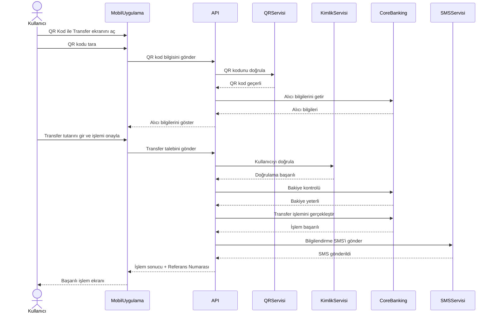

# Sequence Diagram - QR Kod ile Para Transferi

## Amaç

Bu doküman, QR kod kullanılarak gerçekleştirilen para transferi sırasında kullanıcı, mobil uygulama ve arka plandaki sistemler arasında gerçekleşen mesajlaşma sırasını göstermektedir.

## Kapsam

Bu diyagram aşağıdaki süreci kapsamaktadır:

- QR kodunun okutulması
- QR kod bilgilerinin doğrulanması
- Alıcı bilgilerinin getirilmesi
- Transfer talebinin oluşturulması
- Kullanıcı doğrulaması
- Bakiye kontrolü
- Transfer işleminin gerçekleştirilmesi
- SMS bildiriminin gönderilmesi
- İşlem sonucunun kullanıcıya iletilmesi

## Ön Koşullar

- Kullanıcı sisteme giriş yapmış olmalıdır.
- Mobil uygulama ve servisler erişilebilir durumda olmalıdır.
- QR kod okunabilir durumda olmalıdır.

---

## Sequence Diagram

---

## Süreç Açıklaması

1. Kullanıcı QR Kod ile Transfer ekranını açar.
2. QR kod mobil uygulama tarafından okutulur.
3. QR kod bilgisi API katmanına iletilir.
4. API, QR Servisi üzerinden kodun geçerliliğini doğrular.
5. Geçerli QR koddan alıcı bilgileri alınır.
6. Alıcı bilgileri kullanıcıya gösterilir.
7. Kullanıcı transfer tutarını girerek işlemi onaylar.
8. API, Kimlik Servisi üzerinden kullanıcı doğrulamasını gerçekleştirir.
9. Core Banking sistemi hesap bakiyesini kontrol eder.
10. Transfer işlemi gerçekleştirilir.
11. SMS Servisi kullanıcıya bilgilendirme mesajı gönderir.
12. İşlem sonucu ve referans numarası mobil uygulamaya iletilir.

---

## Alternatif Akışlar

### AF-01 – Geçersiz QR Kod

QR kod doğrulanamazsa kullanıcıya hata mesajı gösterilir ve işlem sonlandırılır.

### AF-02 – Kimlik Doğrulaması Başarısız

Kimlik doğrulaması başarısız olursa transfer işlemi gerçekleştirilmez.

### AF-03 – Yetersiz Bakiye

Hesap bakiyesi yetersizse transfer işlemi gerçekleştirilmez ve kullanıcı bilgilendirilir.

### AF-04 – SMS Servisine Ulaşılamadı

Transfer başarılı olsa bile SMS bildirimi gönderilemezse sistem hata kaydı oluşturur ve transfer tamamlanmış olarak kabul edilir.

---

## Son Koşullar

Başarılı senaryoda:

- Para transferi tamamlanmıştır.
- Referans numarası oluşturulmuştur.
- İşlem geçmişine kayıt eklenmiştir.
- Kullanıcı işlem sonucu hakkında bilgilendirilmiştir.

Başarısız senaryoda:

- Transfer işlemi gerçekleştirilmez.
- Kullanıcı uygun hata mesajı ile bilgilendirilir.

---

## Sistemde Yer Alan Bileşenler

| Bileşen | Açıklama |
|----------|----------|
| Kullanıcı | Para transferini başlatan banka müşterisi |
| Mobil Uygulama | Kullanıcının işlem yaptığı istemci uygulama |
| API | Mobil uygulama ile bankacılık servisleri arasındaki iletişimi sağlar |
| QR Servisi | QR kodunu doğrular ve ilgili bilgileri sağlar |
| Kimlik Servisi | Kullanıcının kimliğini doğrular |
| Core Banking | Hesap ve transfer işlemlerini gerçekleştirir |
| SMS Servisi | İşlem sonrası kullanıcıya bilgilendirme mesajı gönderir |

---

## Sonuç

Bu Sequence Diagram, QR kod kullanılarak gerçekleştirilen para transferi sürecinde sistem bileşenleri arasındaki mesajlaşma sırasını göstermektedir. Doküman, geliştirme ve test ekiplerinin sistem etkileşimlerini anlamasını kolaylaştırmak amacıyla hazırlanmıştır.
