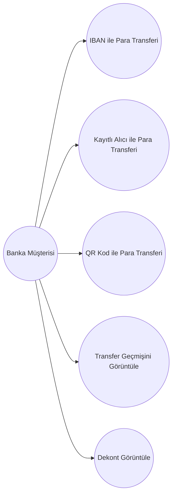

# Use Case Diagram - Dijital Bankacılık Para Transferi

## Amaç

Bu doküman, dijital bankacılık uygulamasındaki para transferi modülünde yer alan aktörleri ve sistem ile gerçekleştirdikleri etkileşimleri görselleştirmek amacıyla hazırlanmıştır.

## Kapsam

Bu diyagram aşağıdaki para transferi senaryolarını kapsamaktadır:

- IBAN ile Para Transferi
- Kayıtlı Alıcı ile Para Transferi
- QR Kod ile Para Transferi

## Aktörler

| Aktör | Açıklama |
|--------|----------|
| Banka Müşterisi | Mobil bankacılık uygulamasını kullanarak para transferi gerçekleştiren kullanıcıdır. |

## Ön Koşullar

- Kullanıcı sisteme giriş yapmış olmalıdır.
- Kullanıcının aktif bir banka hesabı bulunmalıdır.
- Para transferi hizmeti kullanılabilir durumda olmalıdır.

---

## Use Case Diagram

---

# Use Case Listesi

| Use Case ID | Use Case Adı | Açıklama |
|--------------|--------------|----------|
| UC-001 | IBAN ile Para Transferi | Kullanıcı IBAN bilgisi girerek başka bir hesaba para transferi gerçekleştirir. |
| UC-002 | Kayıtlı Alıcı ile Para Transferi | Kullanıcı kayıtlı alıcı listesinden seçim yaparak transfer gerçekleştirir. |
| UC-003 | QR Kod ile Para Transferi | Kullanıcı QR kod okutarak para transferi gerçekleştirir. |
| UC-004 | Transfer Geçmişini Görüntüle | Kullanıcı daha önce gerçekleştirdiği transferleri görüntüler. |
| UC-005 | Dekont Görüntüle | Kullanıcı başarılı işlemlere ait dekontları görüntüler. |

---

# Use Case Açıklamaları

## UC-001 – IBAN ile Para Transferi

**Aktör**

- Banka Müşterisi

**Amaç**

Kullanıcının başka bir banka hesabına IBAN bilgisi kullanarak para transferi yapmasını sağlamak.

**Temel Akış**

1. Kullanıcı para transferi ekranını açar.
2. IBAN bilgisini girer.
3. Transfer tutarını belirler.
4. İşlem özetini kontrol eder.
5. Güvenlik doğrulamasını tamamlar.
6. Transfer gerçekleştirilir.

**Alternatif Akışlar**

- Geçersiz IBAN
- Yetersiz bakiye
- Güvenlik doğrulaması başarısız
- İşlem iptal edilir

---

## UC-002 – Kayıtlı Alıcı ile Para Transferi

**Amaç**

Kayıtlı alıcı listesinden seçim yapılarak hızlı para transferi gerçekleştirilmesini sağlamak.

---

## UC-003 – QR Kod ile Para Transferi

**Amaç**

QR kod okutularak alıcı bilgilerinin otomatik doldurulmasını ve para transferinin gerçekleştirilmesini sağlamak.

---

## UC-004 – Transfer Geçmişini Görüntüle

**Amaç**

Kullanıcının geçmiş para transferlerini görüntüleyebilmesini sağlamak.

---

## UC-005 – Dekont Görüntüle

**Amaç**

Kullanıcının başarılı para transferlerine ait dekont bilgilerini görüntüleyebilmesini sağlamak.

---

## Son Koşullar

Başarılı senaryoda:

- Para transferi tamamlanmıştır.
- İşlem geçmişine kayıt eklenmiştir.
- Dekont oluşturulmuştur.

Başarısız senaryoda:

- İşlem gerçekleştirilmez.
- Kullanıcı uygun hata mesajı ile bilgilendirilir.

---

## Sonuç

Bu Use Case Diagram, para transferi modülündeki temel kullanıcı etkileşimlerini göstermektedir. Doküman; iş analistleri, yazılım geliştiriciler, test ekipleri ve diğer proje paydaşları için ortak bir referans niteliğindedir.
